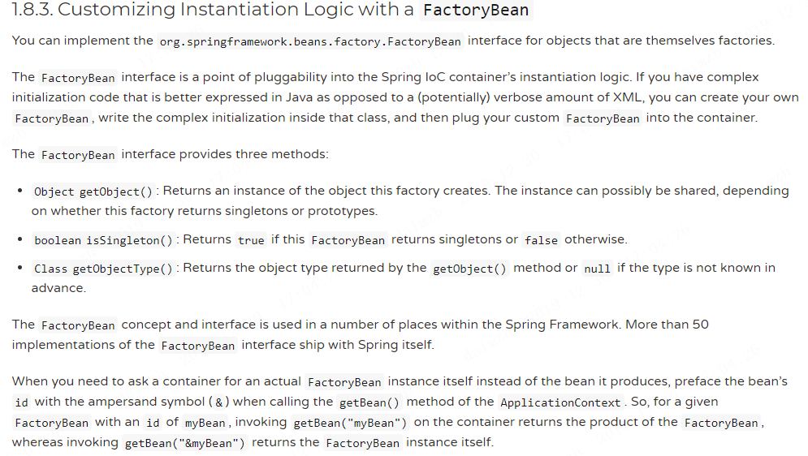
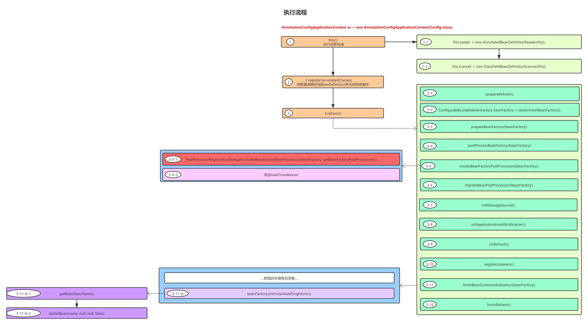

Spring官网阅读（七）容器的扩展点（二）FactoryBean

> 在上篇文章中我们已经对容器的第一个扩展点（`BeanFactoryPostProcessor`）做了一系列的介绍。其中主要介绍了Spring容器中`BeanFactoryPostProcessor`的执行流程。已经Spring自身利用了`BeanFactoryPostProcessor`完成了什么功能，对于一些细节问题可能说的不够仔细，但是在当前阶段我想要做的主要是为我们以后学习源码打下基础。所以对于这些问题我们暂且不去过多纠结，待到源码学习阶段我们会进行更加细致的分析。
>
> 在本篇文章中，我们将要学习的是容器的另一个扩展点（`FactoryBean`）,对于`FactoryBean`官网上的介绍甚短，但是如果我们对Spring的源码有一定了解，可以发现Spring在很多地方都对这种特殊的Bean做了处理。话不多说，我们开始进入正文。

我们还是先看看官网上是怎么说的：

### 官网介绍



从上面这段文字我们可以得出以下几个信息：

1. `FactoryBean`主要用来定制化Bean的创建逻辑
2. 当我们实例化一个Bean的逻辑很复杂的时候，使用`FactoryBean`是很必要的，这要可以规避我们去使用冗长的XML配置
3. `FactoryBean`接口提供了以下三个方法：

- `Object getObject()`: 返回这个`FactoryBean`所创建的对象。
- `boolean isSingleton()`: 返回`FactoryBean`所创建的对象是否为单例，默认返回true。
- `Class getObjectType()`: 返回这个`FactoryBean`所创建的对象的类型，如果我们能确认返回对象的类型的话，我们应该正常对这个方法做出实现，而不是返回null。

4. Spring自身大量使用了`FactoryBean`这个概念，至少有50个`FactoryBean`的实现类存在于Spring容器中
5. 假设我们定义了一个`FactoryBean`，名为`myFactoryBean`，当我们调用`getBean("myFactoryBean")`方法时返回的并不是这个`FactoryBean`，而是这个`FactoryBean`所创建的Bean，如果我们想获取到这个`FactoryBean`需要在名字前面拼接"&"，行如这种形式：`getBean("&myFactoryBean")`

上面这些概念可能刚刚说的时候大家不是很明白，下面我们通过`FactoryBean`的一些应用来进一步体会这个接口的作用。

### `FactoryBean`的应用

我们来看下面这个Demo:

```java
public class MyFactoryBean implements FactoryBean {
	@Override
	public Object getObject() throws Exception {
		System.out.println("执行了一段复杂的创建Bean的逻辑");
		return new TestBean();
	}

	@Override
	public Class<?> getObjectType() {
		return TestBean.class;
	}

	@Override
	public boolean isSingleton() {
		return true;
	}
}

public class TestBean {
	public TestBean(){
		System.out.println("TestBean被创建出来了");
	}
}
// 测试类
public class Main {
	public static void main(String[] args) {
		AnnotationConfigApplicationContext ac=
				new AnnotationConfigApplicationContext(Config.class);
		System.out.println("直接调用getBean(\"myFactoryBean\")返回："+ac.getBean("myFactoryBean"));
		System.out.println("调用getBean(\"&myFactoryBean\")返回："+ac.getBean("&myFactoryBean"));
	}
}
```

运行后结果如下：

------

> 执行了一段复杂的创建Bean的逻辑
> TestBean被创建出来了
> 直接调用getBean("myFactoryBean")返回：com.dmz.official.extension.factorybean.TestBean@28f67ac7
> 调用getBean("&myFactoryBean")返回：com.dmz.official.extension.factorybean.MyFactoryBean@256216b3

------

我们虽然没有直接将`TestBean`放入Spring容器中，但是通过`FactoryBean`也完成了这一操作。同时当我们直接调用`getBean("FactoryBean的名称")`获取到的是`FactoryBean`创建的Bean，但是添加了“&”后可以获取到`FactoryBean`本身。

### `FactoryBean`相关源码分析

我们先看下下面这张图：



涉及到`FactoryBean`主要在`3-11-6`这一步中，我们主要关注下面这段代码：

```java
// .....省略无关代码.......

// 1.判断是不是一个FactoryBean
if (isFactoryBean(beanName)) {
    // 2.如果是一个FactoryBean那么在getBean时，添加前缀“&”，获取这个FactoryBean
    Object bean = getBean(FACTORY_BEAN_PREFIX + beanName);
    if (bean instanceof FactoryBean) {
        final FactoryBean<?> factory = (FactoryBean<?>) bean;
        boolean isEagerInit;
        // 3.做权限校验，判断是否是一个SmartFactoryBean，并且不是懒加载的
        if (System.getSecurityManager() != null && factory instanceof SmartFactoryBean) {
            isEagerInit = AccessController.doPrivileged((PrivilegedAction<Boolean>)
                                                        ((SmartFactoryBean<?>) factory)::isEagerInit,
                                                        getAccessControlContext());
        }
        else {
            // 3.判断是否是一个SmartFactoryBean，并且不是懒加载的
            isEagerInit = (factory instanceof SmartFactoryBean &&
                           ((SmartFactoryBean<?>) factory).isEagerInit());
        }
        if (isEagerInit) {
            // 4.如果是一个SmartFactoryBean并且不是懒加载的，那么创建这个FactoryBean创建的Bean
            getBean(beanName);
        }
    }
}
else {
    // 不是一个FactoryBean，直接创建这个Bean
    getBean(beanName);
}
// ...省略无关代码.....
```

我们按照顺序一步步分析，首先看第一步:

1. 判断是不是一个`FactoryBean`，对应源码如下：

```java
public boolean isFactoryBean(String name) throws NoSuchBeanDefinitionException {
    String beanName = transformedBeanName(name);
    // 直接从单例池中获取这个Bean，然后进行判断，看是否是一个FactoryBean
    Object beanInstance = getSingleton(beanName, false);
    if (beanInstance != null) {
        return (beanInstance instanceof FactoryBean);
    }
    // 查找不到这个BeanDefinition，那么从父容器中再次确认是否是一个FactoryBean
    if (!containsBeanDefinition(beanName) && getParentBeanFactory() instanceof ConfigurableBeanFactory) {
        // No bean definition found in this factory -> delegate to parent.
        return ((ConfigurableBeanFactory) getParentBeanFactory()).isFactoryBean(name);
    }
    // 从当前容器中，根据BeanDefinition判断是否是一个FactoryBean
    return isFactoryBean(beanName, getMergedLocalBeanDefinition(beanName));
}
```

2. 如果是一个`FactoryBean`那么在`getBean`时，添加前缀“&”，获取这个`FactoryBean`
3. 判断是否是一个`SmartFactoryBean`，并且不是懒加载的

这里涉及到一个概念，就是`SmartFactoryBean`，实际上这个接口继承了`FactoryBean`接口，并且`SmartFactoryBean`是`FactoryBean`的唯一子接口，它扩展了`FactoryBean`多提供了两个方法如下：

```java
// 是否为原型，默认不是原型
default boolean isPrototype() {
    return false;
}

// 是否为懒加载，默认为懒加载
default boolean isEagerInit() {
    return false;
}
```

从上面的代码中可以看出，我们当当实现一个`FactoryBean`接口，Spring并不会在启动时就将这个`FactoryBean`所创建的Bean创建出来，为了避免这种情况，我们有两种办法：

- 实现`SmartFactoryBean`，并重写`isEagerInit`方法，将返回值设置为true
- 我们也可以在一个不是懒加载的Bean中注入这个`FactoryBean`所创建的Bean，Spring在解决依赖关系也会帮我们将这个Bean创建出来

实际上我们可以发现，当我们仅仅实现`FactoryBean`时，其`getObject()`方法所产生的Bean，我们可以当前是懒加载的。

4. 如果是一个`SmartFactoryBean`并且不是懒加载的，那么创建这个`FactoryBean`创建的Bean。这里需要注意的是此时创建的不是这个`FactoryBean`，以为在`getBean`时并没有加一个前缀“&”，所以获取到的是其`getObject()`方法所产生的Bean。

在上面的代码分析完后，在`3-6-11-2`中也有两行`FactoryBean`相关的代码，如下：

```java
protected <T> T doGetBean(final String name, @Nullable final Class<T> requiredType,
                          @Nullable final Object[] args, boolean typeCheckOnly) throws BeansException {
	
    // 1.获取bean名称
    final String beanName = transformedBeanName(name);
    Object bean;
	
    //...省略无关代码...，这里主要根据beanName创建对应的Bean
	
    // 2.调用getObject对象创建Bean
        bean = getObjectForBeanInstance(sharedInstance, name, beanName, null);
    }
```

1. 获取bean名称

```java
protected String transformedBeanName(String name) {
    // 這個方法主要用來解析別名，如果是別名的話，获取真实的BeanName
    return canonicalName(BeanFactoryUtils.transformedBeanName(name));
}

 // 处理FactoryBean
public static String transformedBeanName(String name) {
    Assert.notNull(name, "'name' must not be null");
    // 没有带“&”，直接返回
    if (!name.startsWith(BeanFactory.FACTORY_BEAN_PREFIX)) {
        return name;
    }
    // 去除所有的“&”，防止这种写法getBean("&&&&beanName")
    return transformedBeanNameCache.computeIfAbsent(name, beanName -> {
        do {
            beanName = beanName.substring(BeanFactory.FACTORY_BEAN_PREFIX.length());
        }
        while (beanName.startsWith(BeanFactory.FACTORY_BEAN_PREFIX));
        return beanName;
    });
}
```

2. 如果是一个`FactoryBean`，将会调用其`getObject()`方法，如果不是直接返回。

我们可以看到，在调用`getObjectForBeanInstance(sharedInstance, name, beanName, null);`传入了一个参数---name，也就是还没有经过`transformedBeanName`方法处理的bean的名称，可能会带有“&”符号，Spring通过这个参数判断这个Bean是不是一个`FactoryBean`,如果是的话，会调用其`getObject()`创建Bean。**被创建的Bean不会存放于单例池中，而是放在一个名为`factoryBeanObjectCache`的缓存中。**具体的代码因为比较复杂，在这里我们就暂且不分析了，大家可以先留个印象，源码阶段我会做详细的分析。

### Spring中”*`FactoryBean`*“概念的汇总（纯粹个人观点）

除了我们在上文中说到的实现了`FactoryBean`或者`SmartFactoryBean`接口的Bean可以称之为一个”*`FactoryBean`*“，不知道大家对`BeanDefinition`中的一个属性是否还有印象。`BeanDefinition`有属性如下（实际上这个属性存在于`AbstractBeanDefinition`中）：

```java
@Nullable
private String factoryBeanName;
@Nullable
private String factoryMethodName;
```

对于这个属性跟我们这篇文章中介绍的`FactoryBean`有什么关系呢？

首先，我们看看什么情况下`bd`中会存在这个属性，主要分为以下两种情况：

**第一种情况：**

```java
@Configuration
public class Config {
	@Bean
	public B b(){
		return new B();
	}
}
```

我们通过`@Bean`的方式来创建一个Bean，那么在B的`BeanDefinition`会记录`factoryBeanName`这个属性，同时还会记录是这个Bean中的哪个方法来创建B的。在上面的例子中，`factoryBeanName`=`config`，`factoryMethodName`=b。

**第二种情况：**

```xml
<bean id="factoryBean" class="com.dmz.official.extension.factorybean.C"/>

<bean id="b" class="com.dmz.official.extension.factorybean.B" factory-bean="factoryBean" factory-method="b"/>
```

通过XML的方式进行配置，此时B的`BeanDefinition`中`factoryBeanName`=`factoryBean`，`factoryMethodName`=b。

上面两种情况，`BeanDefinition`中的`factoryBeanName`这个属性均不会为空，但是请注意此时记录的这个名字所以对于的Bean并不是一个实现了`FactoryBean`接口的Bean。

综上，我们可以将Spring中的`FactoryBean`的概念泛化，也就是说所有生产对象的Bean我们都将其称为`FactoryBean`，那么可以总结画图如下：


这是个人观点哈，没有在官网找到什么文档，只是这种比较学习更加能加深印象，所以我把他们做了一个总结，大家面试的时候不用这么说

### 跟`FactoryBean`相关常见的面试题

#### 1、`FactoryBean`跟`BeanFactory`的区别

`FactoryBean`就如我们标题所说，是Spring提供的一个扩展点，适用于复杂的Bean的创建。`mybatis`在跟Spring做整合时就用到了这个扩展点。并且`FactoryBean`所创建的Bean跟普通的Bean不一样。我们可以说`FactoryBean`是Spring创建Bean的另外一种手段。

而`BeanFactory`是什么呢？`BeanFactory`是`Spring IOC`容器的顶级接口，其实现类有`XMLBeanFactory`，`DefaultListableBeanFactory`以及`AnnotationConfigApplicationContext`等。`BeanFactory`为Spring管理Bean提供了一套通用的规范。接口中提供的一些方法如下：

```java
boolean containsBean(String beanName)

Object getBean(String)

Object getBean(String, Class)

Class getType(String name)

boolean isSingleton(String)

String[] getAliases(String name)
```

通过这些方法，可以方便地获取bean，对Bean进行操作和判断。

#### 2、如何把一个对象交给Spring管理

首先，我们要弄明白一点，这个问题是说，怎么把一个***对象***交給Spring管理，“对象”要划重点，我们通常采用的注解如`@Compent`或者XML配置这种类似的操作并不能将一个对象交给Spring管理，而是让Spring根据我们的配置信息及类信息创建并管理了这个对象，形成了Spring中一个Bean。把一个对象交给Spring管理主要有两种方式

- 就是用我们这篇文章中的主角，`FactoryBean`，我们直接在`FactoryBean`的`getObject`方法直接返回需要被管理的对象即可
- `@Bean`注解，同样通过`@Bean`注解标注的方法直接返回需要被管理的对象即可。

### 总结

在本文中我们完成了对`FactoryBean`的学习，最重要的是我们需要明白一点，`FactoryBean`是Spring中特殊的一个Bean，Spring利用它提供了另一种创建Bean的方式，`FactoryBean`整体的体系比较复杂，`FactoryBean`是如何创建一个Bean的一些细节我们还没有涉及到，不过不要急，在源码学习阶段我们还会接触到它，并会对其的整个流程做进一步的分析。目前容器的扩展点我们还剩最后一个部分，即`BeanPostProcessor`。`BeanPostProcessor`贯穿了整个Bean的生命周期，学习的难度更大。希望大家跟我一步步走下去，认认真真学习完Spring，加油！

