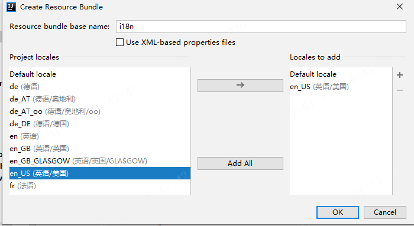
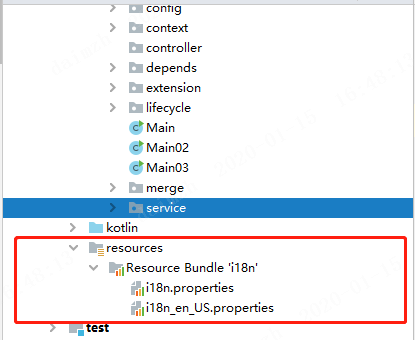
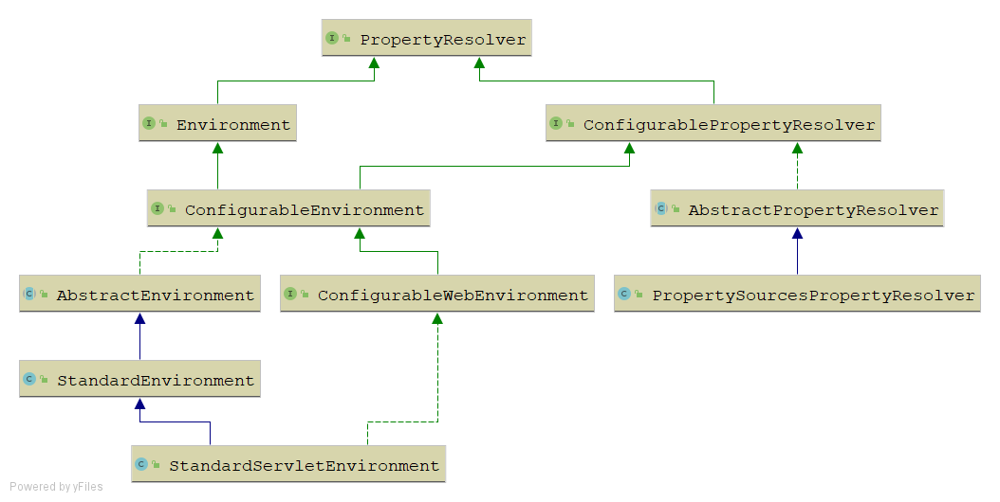
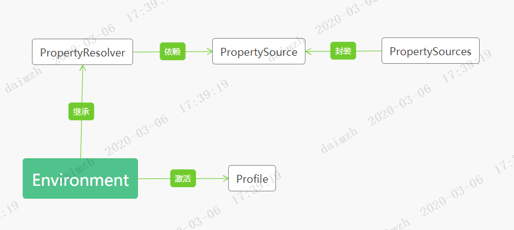

Spring官网阅读（十一）ApplicationContext详细介绍（上）

> 在前面的文章中，我们已经完成了官网中关于`IOC`内容核心的部分。包括容器的概念，Spring创建Bean的模型`BeanDefinition`的介绍，容器的扩展点（`BeanFactoryPostProcessor`，`FactroyBean`，`BeanPostProcessor`）以及最重要的Bean的生命周期等。接下来大概还要花三篇文章完成对官网中第一大节的其它内容的学习，之所以要这么做，是笔者自己粗读了一篇源码后，再读一遍官网，发现源码中的很多细节以及难点都在官网中介绍了。所以这里先跟大家一起把官网中的内容都过一遍，也是为了更好的进入源码学习阶段。
>
> 本文主要涉及到官网中的[1.13](https://docs.spring.io/spring/docs/5.1.13.BUILD-SNAPSHOT/spring-framework-reference/core.html#beans-environment),[1.15](https://docs.spring.io/spring/docs/5.1.13.BUILD-SNAPSHOT/spring-framework-reference/core.html#context-introduction),[1.16](https://docs.spring.io/spring/docs/5.1.13.BUILD-SNAPSHOT/spring-framework-reference/core.html#beans-beanfactory)小节中的内容以及[第二大节](https://docs.spring.io/spring/docs/5.1.13.BUILD-SNAPSHOT/spring-framework-reference/core.html#resources)的内容

# ApplicationContext

## 1、<span id="extends">ApplicationContext的继承关系</span>


从上图中可以发现，`ApplicationContext`接口继承了很多接口，这些接口我们可以将其分为五类：

- `MessageSource`，主要用于国际化

- `ApplicationEventPublisher`，提供了事件发布功能
- `EnvironmentCapable`，可以获取容器当前运行的环境
- `ResourceLoader`，主要用于加载资源文件
- `BeanFactory`，负责配置、创建、管理Bean，`IOC`功能的实现主要就依赖于该接口子类实现。

关于这些的接口的具体功能的介绍在后文会介绍，当前我们需要知道最重要的一点就是`ApplicationContext`继承了`BeanFactory`接口，也就是说它具有`BeanFactory`所有的功能。

## 2、ApplicationContext的功能

### Spring中的国际化（MessageSource）

#### 国际化是什么？

应用程序运行时，可根据客户端操作系統的国家/地区、语言的不同而显示不同的界面，比如客户端OS的语言环境为大陆的简体中文，程序就显示为简体中文，客户端OS的语言环境为美国——英语，程序就显示美式英语。OS的语言环境可在控制面板中手动设置。国际化的英文单词是Internationalization，单词较长，通常简称`i18n`，I是第一个字母，18表示中间省略了18个字母，N是最后一个字母。

假设我们正在开发一个支持多国语言的Web应用程序，要求系统能够根据客户端的系统的语言类型返回对应的界面：英文的操作系统返回英文界面，而中文的操作系统则返回中文界面——这便是典型的`i18n`国际化问题。对于有国际化要求的应用系统，我们不能简单地采用硬编码的方式编写用户界面信息、报错信息等内容，而必须为这些需要国际化的信息进行特殊处理。简单来说，就是**为每种语言提供一套相应的资源文件，并以规范化命名的方式保存在特定的目录中，由系统自动根据客户端语言选择适合的资源文件**。

#### JAVA中的国际化

**国际化信息**也称为**本地化信息**，一般需要两个条件才可以确定一个特定类型的本地化信息，它们分别是“*语言类型*”和“*国家/地区的类型*”。如中文本地化信息既有中国大陆地区的中文，又有中国台湾、中国香港地区的中文，还有新加坡地区的中文。

【部分国际化代码】：

```
ar_sa 阿拉伯语(沙特阿拉伯)
ar_iq 阿拉伯语(伊拉克) 
eu 巴斯克语
bg 保加利亚语 
zh_tw 中文(中国台湾)
zh_cn 中文(中华人民共和国)
zh_hk 中文(中国香港特别行政区)
zh_sg 中文(新加坡)
hr 克罗地亚语 
en 英语
en_us 英语(美国)
en_gb 英语(英国)
en_au 英语(澳大利亚)
en_ca 英语(加拿大)
```

##### 本地化对象（Locale）

Java通过`java.util.Locale`类表示一个本地化对象，它允许通过语言参数和国家/地区参数创建一个确定的本地化对象。

```java
Locale locale=new Locale("zh","cn");//中文，中国
Locale locale2=new Locale("en","us");//英文，美国
Locale locale3=new Locale("zh");//中文--不指定国家
Locale locale4=Locale.CHINA;//中文，中国
Locale locale5=Locale.CHINESE;//中文
```

在持有一个`Locale`对象后，我们需要将同一个文字或者数字根据不同的地区/语言格式化成不同的表现形式，所以这里我们还需要一个格式化的操作，`JDK`给我们提供以下几个常见的类用于国际化格式化

`NumberFormat`：可以处理数字，百分数，货币等。下面以货币为例：

```java
public static void main(String[] args) {
    // 1.通过语言跟地区确定一个Locale对象
    // 中国，中文
    Locale chinaLocale = new Locale("zh", "cn");
    // 美国，英文
    Locale usLocale = new Locale("en", "us");
    // 获取货币格式化对象
    NumberFormat chinaCurrencyFormat = NumberFormat.getCurrencyInstance(chinaLocale);
    NumberFormat usLocaleCurrencyFormat = NumberFormat.getCurrencyInstance(usLocale);
    // 中文，中国下的货币表现形式
    String chinaCurrency = chinaCurrencyFormat.format(99.9);  // 输出 ￥99.90
    // 美国，英文下的货币表现形式
    String usCurrency = usLocaleCurrencyFormat.format(99.9); // 输出 $99.90
    System.out.println(chinaCurrency);
    System.out.println(usCurrency);
}
```

##### 格式化对象

`DateFormat`：通过`DateFormat#getDateInstance(int style,Locale locale)`方法按本地化的方式对日期进行格式化操作。该方法第一个入参为时间样式，第二个入参为本地化对象

```java
public static void main(String[] args) {
    // 1.通过语言跟地区确定一个Locale对象
    // 中国，中文
    Locale chinaLocale = new Locale("zh", "cn");
    // 美国，英文
    Locale usLocale = new Locale("en", "us");
    DateFormat chinaDateFormat = DateFormat.getDateInstance(DateFormat.YEAR_FIELD,chinaLocale);
    DateFormat usDateFormat = DateFormat.getDateInstance(DateFormat.YEAR_FIELD,usLocale);
    System.out.println(chinaDateFormat.format(new Date())); // 输出 2020年1月15日
    System.out.println(usDateFormat.format(new Date()));    // 输出 January 15, 2020
}
```

<span id="format">`MessageFormat`</span>：在`NumberFormat`和`DateFormat`的基础上提供了强大的占位符字符串的格式化功能，它支持时间、货币、数字以及对象属性的格式化操作

1. 简单的占位符替换

```java
public static void main(String[] args) {
    // 1.通过语言跟地区确定一个Locale对象
    // 中国，中文
    Locale chinaLocale = new Locale("zh", "cn");
    String str1 = "{0}，你好！你于{1}在农业银行存入{2}。";
    MessageFormat messageFormat = new MessageFormat(str1,chinaLocale);
    Object[] o = {"小红", new Date(), 99.99};
    System.out.println(messageFormat.format(o));
    // 输出：小红，你好！你于20-1-15 下午4:05在农业银行存入99.99。
}
```

2. 指定格式化类型跟格式化样式的占位符替换

```JAVA
public static void main(String[] args) {
    String str1 = "{0}，你好！你于{1,date,long}在农业银行存入{2,number, currency}。";
    MessageFormat messageFormat = new MessageFormat(str1,Locale.CHINA);
    Object[] o = {"小红", new Date(), 1313};
    System.out.println(messageFormat.format(o));
    // 输出：小红，你好！你于2020年1月15日在农业银行存入￥1,313.00。
}
```

在上面的例子中，0，1，2代表的是占位符的索引，从0开始计数。`date`，`number`为格式化的类型。`long`，`currency`为格式化样式。

- **`FormatType`**：格式化类型，取值范围如下：

​     number：调用`NumberFormat`进行格式化

​     date：调用`DateFormat`进行格式化

​     time：调用`DateFormat`进行格式化

​     choice：调用`ChoiceFormat`进行格式化

- **`FormatStyle`**:：设置使用的格式化样式

  short
  medium
  long
  full
  integer
  currency
  percent
  SubformatPattern (子格式模式，形如#.##)

对于具体的使用方法就不多赘述了，大家可以自行百度。

##### 资源文件的加载

在实现国际化的过程中，由于我们的用户界面信息、报错信息等内容都不能采用硬编码的方式，所以为了在不同的区域/语言环境下能进行不同的显示，我们需要为不同的环境提供不同的资源文件，同时需要遵循一定的规范。

- 命名规范：`资源名_语言代码_国/地区代码.properties`

举一个例子：假设资源名为content，语言为英文，国家为美国，则与其对应的本地化资源文件命名为content_en_US.properties。

下面以IDEA为例，创建资源文件并加载读取

1. 创建资源文件，在Resource目录下，创建一个Bundle


2. 添加需要兼容的区域/语言，我这里就添加一个英语/美国，给这个Bundle命名为`i18n`，名字随意



3. 此时会在Resource目录下生成如下的目录结构



在两个配置文件中，我分别添加了两段配置：

【`i18n.properties`】:

```properties
#小明(资源文件对文件内容有严格的要求：只能包含ASCII字符，所以必须将非ASCII字符的内容转换为Unicode代码的表示方式)
name=\u5c0f\u660e
#他十九岁了
age=19
```

【`i18n_en_US.properties`】:

```properties
name=Xiaoming
age=19
```

示例代码：

```java
public static void main(String[] args) {
    // i18n要跟我们之前创建的Bundle的名称一致
    // Locale.US指定了我们要拿这个Bundle下的哪个区域/语言对于的资源文件，这里获取到的是i18n_en_US.properties这个配置文件
    ResourceBundle usResourceBundle = ResourceBundle.getBundle("i18n", Locale.US);
    System.out.println(usResourceBundle.getString("name")); // 输出Xiaoming
    System.out.println(usResourceBundle.getString("age"));
    ResourceBundle chinaResourceBundle = ResourceBundle.getBundle("i18n");
    System.out.println(chinaResourceBundle.getString("name"));  // 输出小明
    System.out.println(chinaResourceBundle.getString("age"));
}
```

#### Spring中的MessageSource

在聊完了JAVA中的国际化后，我们回归主题，`ApplicationContext`接口继承了`MessageSource`接口，`MessageSource`接口又提供了国际化的功能，所以`ApplicationContext`也具有国际化的功能。接下来我们着重看看`MessageSource`这个接口。

##### 接口定义

```java
public interface MessageSource {

     //code表示国际化资源中的属性名；args用于传递格式化串占位符所用的运行期参数；
     //当在资源找不到对应属性名时，返回defaultMessage参数所指定的默认信息；
     //locale表示本地化对象；
    String getMessage(String code, Object[] args, String defaultMessage, Locale locale);

    //与上面的方法类似，只不过在找不到资源中对应的属性名时，
    //直接抛出NoSuchMessageException异常；
    String getMessage(String code, Object[] args, Locale locale) throws NoSuchMessageException;

    //将属性名、参数数组以及默认信息封装起来，它的功能和第一个接口方法相同。
    String getMessage(MessageSourceResolvable resolvable, Locale locale) throws NoSuchMessageException;

}
```

##### UML类图


我们依次分析下各个类的作用

1. `HierarchicalMessageSource`，该接口提供了设置获取父容器的方法，用于构建`MessageSource`体系的父子层级结构。其方法定义如下:

```java
// 为当前MessageSource设置父MessageSource
void setParentMessageSource(@Nullable MessageSource parent);

// 获取当前MessageSource的父MessageSource
@Nullable
MessageSource getParentMessageSource();
```

2. `MessageSourceSupport`，这个类的作用类似于我们之前介绍的[MessageFormat](#format)，主要提供了对消息的格式化功能。从这个继承关系中我们也能看出，Spring在设计时将消息的获取以及格式化进行了分隔。而在我们实际使用到具体的实现类时，又将功能做了聚合。

3. `DelegatingMessageSource`，将所有获取消息的请求委托给父类查找，如果父类没有就报错

4. `AbstractMessageSource`，实现了`HierarchicalMessageSource`，提供了对消息的通用处理方式，方便子类对具体的消息类型实现特定的策略
5. `AbstractResourceBasedMessageSource`，提供了对Bundle的处理方式
6. `ResourceBundleMessageSource`，基于`JDK`的`ResourceBundle`实现，可以根据名称加载Bundle
7. `ReloadableResourceBundleMessageSource`，提供了定时刷新功能，允许在不重启系统的情况下，更新资源的信息。
8. `StaticMessageSource`，主要用于程序测试

##### Spring中的简单使用

我这里直接取官网中的Demo，先看官网上的一段说明：


从上文中，我们可以得出以下几点信息：

1. Spring容器在启动时会自动查找一个名称定义的`messageSource`的Bean（同时需要实现`MessageSource`接口），如果找到了，那么所有获取信息的请求都会由这个类处理。如果在当前容器中没有找到的话，会在父容器中继续查找。
2. 如果没有找到，那么Spring会自己new一个`DelegatingMessageSource`对象，并用这个对象处理消息

基于上面的结论，我们可以做如下配置：

```xml
<!--application.xml-->
<bean id="messageSource"
      class="org.springframework.context.support.ResourceBundleMessageSource">
    <property name="basenames">
        <list>
            <value>format</value>
            <value>exceptions</value>
            <value>windows</value>
        </list>
    </property>
</bean>
```

同时配置下面三个properties文件：

```properties
# in format.properties
message=Alligators rock!
```

```properties
# in exceptions.properties
argument.required=The {0} argument is required.
```

测试代码：

```java
public static void main(String[] args) {
    MessageSource resources = new ClassPathXmlApplicationContext("application.xml");
    String message1 = resources.getMessage("message", null, "Default", null);
    String message2 = resources.getMessage("argument.required",
                                           new Object [] {"userDao"}, "Required", null);
    System.out.println(message1); // 输出 Alligators rock!
    System.out.println(message2); // 输出 The userDao argument is required.
}
```

同时Spring对资源的加载也遵循我们在JAVA国际化中提到的规范，我们可以将上面例子中的`exceptions.properties`，更名为`exceptions_en_GB.properties`。

```JAVA
// 可以看出这种方式跟我们使用JAVA直接加载国际化资源没有太大差别
public static void main(final String[] args) {
    MessageSource resources = new ClassPathXmlApplicationContext("beans.xml");
    String message = resources.getMessage("argument.required",
        new Object [] {"userDao"}, "Required", Locale.UK);
    System.out.println(message);
}
```

### <span id="env">Spring中的环境（Environment）</span>>

> 这小结内容对应官网中的[1.13](https://docs.spring.io/spring/docs/5.1.13.BUILD-SNAPSHOT/spring-framework-reference/core.html#beans-environment)小节

在前面的[ApplicationContext的继承关系](#extends)中我们知道`ApplicationContext`这个接口继承了一个`EnvironmentCapable`接口，而这个接口的定义非常简单，如下

```java
public interface EnvironmentCapable {
	Environment getEnvironment();
}
```

可以看到它只是简单的提供了一个获取`Environment`对象的方法，那么这个`Environment`对象是做什么的呢？

##### 1、什么是环境（Environment）？

它其实代表了当前Spring容器的运行环境，比如`JDK`环境，系统环境；每个环境都有自己的配置数据，如`System.getProperties()`可以拿到`JDK`环境数据、`System.getenv()`可以拿到系统变量，`ServletContext.getInitParameter()`可以拿到`Servlet`环境配置数据。Spring抽象了一个Environment来表示Spring应用程序环境配置，它整合了各种各样的外部环境，并且提供统一访问的方法。

##### <span id="jiekou">2、接口定义</span>

```java
public interface Environment extends PropertyResolver {
    
    // 获取当前激活的Profile的名称
	String[] getActiveProfiles();
	
    // 获取默认的Profile的名称
	String[] getDefaultProfiles();

	@Deprecated
	boolean acceptsProfiles(String... profiles);
	
    // 判断指定的profiles是否被激活
	boolean acceptsProfiles(Profiles profiles);

}

public interface PropertyResolver {
	// 当前的环境中是否包含这个属性
	boolean containsProperty(String key);
	
    //获取属性值 如果找不到返回null   
	@Nullable
	String getProperty(String key);
	
    // 获取属性值，如果找不到返回默认值        
	String getProperty(String key, String defaultValue);
	
    // 获取指定类型的属性值，找不到返回null  
	@Nullable
	<T> T getProperty(String key, Class<T> targetType);
	
    // 获取指定类型的属性值，找不到返回默认值  
	<T> T getProperty(String key, Class<T> targetType, T defaultValue);
	
    // 获取属性值，找不到抛出异常IllegalStateException  
	String getRequiredProperty(String key) throws IllegalStateException;
	
    // 获取指定类型的属性值，找不到抛出异常IllegalStateException         
	<T> T getRequiredProperty(String key, Class<T> targetType) throws IllegalStateException;
	
    // 替换文本中的占位符（${key}）到属性值，找不到不解析  
	String resolvePlaceholders(String text);
    
    // 替换文本中的占位符（${key}）到属性值，找不到抛出异常IllegalArgumentException 
	String resolveRequiredPlaceholders(String text) throws IllegalArgumentException;

}
```

我们可以看到，`Environment`接口继承了`PropertyResolver`，而`Environment`接口自身主要提供了对`Profile`的操作，`PropertyResolver`接口中主要提供了对当前运行环境中属性的操作，如果我们去查看它的一些方法的实现可以发现，对属性的操作大都依赖于`PropertySource`。

所以在对`Environment`接口学习前，我们先要了解`Profile`以及`PropertySource`

##### 3、Profile

我们先看官网上对Profile的介绍：


从上面这段话中我们可以知道

1. Profile是一组逻辑上的Bean的定义
2. 只有这个Profile被激活时，这组Bean才会被注册到容器中
3. 我们既可以通过注解的方式来将Bean加入到指定的Profile中，也可以通过XML的形式
4. `Environment`主要决定哪个Profile要被激活，在没有激活的Profile时要使用哪个作为默认的Profile

###### 注解方式（@Profile）

>  **1、简单使用**

```java
@Component
@Profile("prd")
public class DmzService {
	public DmzService() {
		System.out.println("DmzService in prd");
	}
}

@Component
@Profile("dev")
public class IndexService {
	public IndexService(){
		System.out.println("IndexService in dev");
	}
}

public static void main(String[] args) {
    AnnotationConfigApplicationContext ac = new AnnotationConfigApplicationContext();
    ac.register(ProfileConfig.class);
    //ac.getEnvironment().setActiveProfiles("prd");
    //ac.refresh();  	   // 输出 DmzService in prd
    ac.getEnvironment().setActiveProfiles("dev");
    ac.refresh(); 		   // 输出 IndexService in dev
}
```

在上面的例子中，我们给两个组件（`DmzService`，`IndexService`）配置了不同的profile，可以看到当我们利用Environment激活不同的Profile时，可以分别只创建不同的两个类。

在实际生产环境中，我们往往会将`"prd"`，`"dev"`这种代表环境的标签放到系统环境变量中，这样依赖于不同系统的同一环境变量，我们就可以将应用程序运行在不同的profile下。

> **2、结合逻辑运算符使用**

有时间我们某一组件可能同时要运行在多个profile下，这个时候逻辑运算符就派上用场了，我们可以通过如下的三种运行符，对profile进行逻辑运算

- `!`: 非，只有这个profile不被激活才能生效
- `&`: 两个profile同时激活才能生效
- `|`: 只要其中一个profile激活就能生效

比如在上面的例子中，我们可以新增两个类，如下：

```java
@Component
@Profile("dev & qa")
public class LuBanService {
	public LuBanService(){
		System.out.println("LuBanService in dev & qa");
	}
}

@Component("!prd")
public class ProfileService {
	public ProfileService(){
		System.out.println("ProfileService in !prd");
	}
}

public static void main(String[] args) {
AnnotationConfigApplicationContext ac = new AnnotationConfigApplicationContext();
ac.register(ProfileConfig.class);
//		ac.getEnvironment().setActiveProfiles("prd");
//		ac.refresh();  // 输出 DmzService in prd
//		ac.getEnvironment().setActiveProfiles("dev");
//		ac.refresh(); // 输出 IndexService in dev
ac.getEnvironment().setActiveProfiles("dev","qa");
ac.refresh();// 输出IndexService in dev
//LuBanService in dev & qa
//ProfileService in !prd
}
```

为了编码的语义，有时候我们会将不同的profile封装成不同的注解，如下：

```java
@Target(ElementType.TYPE)
@Retention(RetentionPolicy.RUNTIME)
@Profile("production")
public @interface Production {
}
```

有时候可能我们要将多个Bean同时置于某个profile下，这个时候每个Bean添加一个`@Profile`注解显得过去麻烦，这个时候如果我们是采用`@Bean`方式申明的Bean，可以直接在配置类上添加`@Profile`注解，如下（这里我直接取官网中的例子了，就不做验证了）：

```java
@Configuration
public class AppConfig {

    @Bean("dataSource")
    @Profile("development") 
    public DataSource standaloneDataSource() {
        return new EmbeddedDatabaseBuilder()
            .setType(EmbeddedDatabaseType.HSQL)
            .addScript("classpath:com/bank/config/sql/schema.sql")
            .addScript("classpath:com/bank/config/sql/test-data.sql")
            .build();
    }

    @Bean("dataSource")
    @Profile("production") 
    public DataSource jndiDataSource() throws Exception {
        Context ctx = new InitialContext();
        return (DataSource) ctx.lookup("java:comp/env/jdbc/datasource");
    }
}
```

>  3、注意一种特殊的场景

如果我们对使用了@Bean注解的方式进行了重载，那么要求所有重载的方法都在同一个@Profile下，否则@Profile的语义会被覆盖。什么意思呢？大家看下面这个Demo

```java
public class A {
	public A() {
		System.out.println("independent A");
	}
	public A(B b) {
		System.out.println("dependent A with B");
	}
}

public class B {

}

@Configuration
public class ProfileConfig {
	@Bean
	@Profile("dev")
	public A a() {
		return new A();
	}

	@Bean
	@Profile("prd")
	public A a(B b) {
		return new A(b);
	}

	@Bean
	@Profile("prd | dev")
	public B b() {
		return new B();
	}
}

public static void main(String[] args) {
    AnnotationConfigApplicationContext ac = new AnnotationConfigApplicationContext();
    ac.register(ProfileConfig.class);
    ac.getEnvironment().setActiveProfiles("dev");
    ac.refresh(); // 输出：dependent A with B
}
```

我们明明激活的是`dev`这个profile，为什么创建的用的带参的构造函数呢？这是因为Spring在创建Bean时，方法的优先级高于Profile，前提是方法的参数在Spring容器内（在上面的例子中，如果我们将B的profile限定为`dev`，那么创建的A就会是通过空参构造创建的）。这里暂且不多说，大家知道有这种场景存在即可。在后面分析源码时我们会介绍，这里涉及到Spring对创建Bean的方法的推断（既包括构造函数也包括`factroyMethod`）。

###### XML方式

```xml
<!--在beans标签中指定profile属性即可-->
<beans profile="development"
    xmlns="http://www.springframework.org/schema/beans"
    xmlns:xsi="http://www.w3.org/2001/XMLSchema-instance"
    xmlns:jdbc="http://www.springframework.org/schema/jdbc"
    xsi:schemaLocation="...">

    <jdbc:embedded-database id="dataSource">
        <jdbc:script location="classpath:com/bank/config/sql/schema.sql"/>
        <jdbc:script location="classpath:com/bank/config/sql/test-data.sql"/>
    </jdbc:embedded-database>
</beans>
```

XML方式不多赘述，大家有需要可以自行研究

##### 4、PropertySource

通过我们的`Environment`对象，除了能操作profile对象之外，通过之前的继承结构我们知道，他还能进行一些关于属性的操作。而这些操作是建立在Spring本身对运行环境中的一些属性文件的抽象而来的。抽象而成的结果就是`PropertySource`。

###### 接口定义

```java
public abstract class PropertySource<T> {
    protected final  String name;//属性源名称
    protected final T source;//属性源（比如来自Map，那就是一个Map对象）
    public String getName();  //获取属性源的名字  
    public T getSource();        //获取属性源  
    public boolean containsProperty(String name);  //是否包含某个属性  
    public abstract Object getProperty(String name);   //得到属性名对应的属性值   
    // 返回一个ComparisonPropertySource对象
    public static PropertySource<?> named(String name) {
		return new ComparisonPropertySource(name);
	}
} 
```

除了上面定义的这些方法外，`PropertySource`中还定义了几个静态内部类，我们在下面的`UML`类图分析时进行介绍

###### UML类图


从上图中可以看到，基于`PropertySource`子类主要可以分为两类，一类是`StubPropertySource`，另一类是`EnumerablePropertySource`。而`StubPropertySource`这一类都是申明于`PropertySource`中的静态内部类。这两个类主要是为了完成一些特殊的功能而设计的。

1. `StubPropertySource`：这个类主要起到类似一个占位符的作用，例如，一个基于`ServletContext`的`PropertySource`必须等待，直到`ServletContext`对象对这个`PropertySource`所在的上下文可用。在这种情况下，需要用到`StubPropertySource`来预设这个`PropertySource`的位置跟顺序，之后在上下文刷新时期，再用一个`ServletContextPropertySourc`来进行替换
2. `ComparisonPropertySource`：这个类设计的目的就是为了进行比较，除了`hashCode()`，`equals()`，`toString()`方法能被调用外，其余方法被调用时均会抛出异常

而`PropertySource`的另外一些子类，都是继承自`EnumerablePropertySource`的，我们先来看`EnumerablePropertySource`这个类对其父类`PropertySource`进行了哪些补充，其定义如下：

```java
public abstract class EnumerablePropertySource<T> extends PropertySource<T> {

	public EnumerablePropertySource(String name, T source) {
		super(name, source);
	}

	protected EnumerablePropertySource(String name) {
		super(name);
	}
	
    // 复写了这个方法
	@Override
	public boolean containsProperty(String name) {
		return ObjectUtils.containsElement(getPropertyNames(), name);
	}
	
    // 新增了这个方法
	public abstract String[] getPropertyNames();

}
```

这个类跟我们`PropertySource`的区别在于：

1. 复写了`containsProperty`这个方法
2. 新增了一个`getPropertyNames`方法

并且我们可以看到，再`containsProperty`这个方法中调用了`getPropertyNames`，这么做的理由是什么呢？为什么它不直接使用父类的`containsProperty`方法而要自己复写一个呢？我们对比下父类的实现：

```java
public boolean containsProperty(String name) {
    return (getProperty(name) != null);
}
```

结合这个类上的一段`javadoc`，如下：

> A {@link PropertySource} implementation capable of interrogating its
> underlying source object to enumerate all possible property name/value
> pairs. Exposes the {@link #getPropertyNames()} method to allow callers
> to introspect available properties without having to access the underlying
> source object. This also facilitates a more efficient implementation of
> {@link #containsProperty(String)}, in that it can call {@link #getPropertyNames()}
> and iterate through the returned array rather than attempting a call to
> {@link #getProperty(String)} which may be more expensive. Implementations may
> consider caching the result of {@link #getPropertyNames()} to fully exploit this
> performance opportunity.

Spring设计这个类的主要目的是为了，让调用者可以不访问其中的`Source`对象但是能判断这个`PropertySource`中是否包含了指定的key，所以它多提供了一个`getPropertyNames`，同时这段`javadoc`还指出，子类的实现应该考虑去缓存`getPropertyNames`这个方法的返回值去尽可能的压榨性能。

接下来，我们分别看一看它的各个实现类

- `MapPropertySource`

`MapPropertySource`的source来自于一个Map，这个类结构很简单，这里不说。
用法如下：

```java
public static void main(String[] args) {
    Map<String,Object> map=new HashMap<>();
    map.put("name","wang");
    map.put("age",23);
    MapPropertySource source_1=new MapPropertySource("person",map);
    System.out.println(source_1.getProperty("name"));//wang
    System.out.println(source_1.getProperty("age"));//23
    System.out.println(source_1.getName());//person
    System.out.println(source_1.containsProperty("class"));//false
}
```

- `ResourcePropertySource`

source是一个Properties对象，继承自`MapPropertySource`。与`MapPropertySource`用法相同

- `ServletConfigPropertySource`

source为`ServletConfig`对象

- `ServletContextPropertySource`

source为`ServletContext`对象

- `SystemEnvironmentPropertySource`

继承自`MapPropertySource`，它的source也是一个map，但来源于系统环境。

- `CompositePropertySource`

内部可以保存多个`PropertySource`

```java
private final Set<PropertySource<?>> propertySources = new LinkedHashSet<PropertySource<?>>();
```

取值时依次遍历这些`PropertySource`

###### PropertySources

我们在阅读`PropertySource`源码上，会发现在其上有一段这样的javaDoc解释，其中提到了

>  <p>{@code PropertySource} objects are not typically used in isolation, but rather
>  through a {@link PropertySources} object, which aggregates property sources and in
>  conjunction with a {@link PropertyResolver} implementation that can perform
>  precedence-based searches across the set of {@code PropertySources}.

也就是说，`PropertySource`通常都不会单独的使用，而是通过`PropertySources`对象。

- 接口定义

```java
public interface PropertySources extends Iterable<PropertySource<?>> {

	default Stream<PropertySource<?>> stream() {
		return StreamSupport.stream(spliterator(), false);
	}
    
	boolean contains(String name);

	@Nullable
	PropertySource<?> get(String name);

}
```

这个接口由于继承了`Iterable`接口，所以它的子类也具备了迭代能力。

- 唯一子类

```java
public class MutablePropertySources implements PropertySources {
private final List<PropertySource<?>> propertySourceList = new CopyOnWriteArrayList<>();
......
}
```

这个类最大的特点就是，持有了一个保存`PropertySource`的`CopyOnWriteArrayList`集合。并且它其余提供的方法，都是在往集合中增删`PropertySource`。

##### 5、PropertyResolver

在之前的[Environment的接口定义](#jiekou)中我们知道，`Environment`接口继承了`PropertyResolver`接口，接下来我们再来关注下这个接口的定义

###### 接口定义

```java
public interface PropertyResolver {
	// 当前的环境中是否包含这个属性
	boolean containsProperty(String key);
	
    //获取属性值 如果找不到返回null   
	@Nullable
	String getProperty(String key);
	
    // 获取属性值，如果找不到返回默认值        
	String getProperty(String key, String defaultValue);
	
    // 获取指定类型的属性值，找不到返回null  
	@Nullable
	<T> T getProperty(String key, Class<T> targetType);
	
    // 获取指定类型的属性值，找不到返回默认值  
	<T> T getProperty(String key, Class<T> targetType, T defaultValue);
	
    // 获取属性值，找不到抛出异常IllegalStateException  
	String getRequiredProperty(String key) throws IllegalStateException;
	
    // 获取指定类型的属性值，找不到抛出异常IllegalStateException         
	<T> T getRequiredProperty(String key, Class<T> targetType) throws IllegalStateException;
	
    // 替换文本中的占位符（${key}）到属性值，找不到不解析  
	String resolvePlaceholders(String text);
    
    // 替换文本中的占位符（${key}）到属性值，找不到抛出异常IllegalArgumentException 
	String resolveRequiredPlaceholders(String text) throws IllegalArgumentException;

}
```

###### UML类图

它的实现类主要有两种：

1. 各种Resolver：主要是`PropertySourcesPropertyResolver`
2. 各种`Environment`



- `PropertySourcesPropertyResolver`使用示例

```java
MutablePropertySources sources = new MutablePropertySources();
sources.addLast(new MapPropertySource("map", new HashMap<String, Object>() {
    {
        put("name", "wang");
        put("age", 12);
    }
}));//向MutablePropertySources添加一个MapPropertySource

PropertyResolver resolver = new PropertySourcesPropertyResolver(sources);
System.out.println(resolver.containsProperty("name"));//输出 true
System.out.println(resolver.getProperty("age"));//输出 12
System.out.println(resolver.resolvePlaceholders("My name is ${name} .I am ${age}."));
```

- 关于`Environment`实现主要分为两种

1. `StandardEnvironment`,标准环境，普通Java应用时使用，会自动注册`System.getProperties() `和 `System.getenv()`到环境
2. `StandardServletEnvironment`：标准`Servlet`环境，其继承了`StandardEnvironment`，Web应用时使用，除了`StandardEnvironment`外，会自动注册`ServletConfig（DispatcherServlet）`、`ServletContext`及有选择性的注册`JNDI`实例到环境

------

### 总结

​        在这篇文章中，我们学习了`ApplicationContext`的部分知识，首先我们知道`ApplicationContext`继承了[5类接口](#extends)，正由于继承了这五类接口，所以它具有了以下这些功能：

- `MessageSource`，主要用于国际化

- `ApplicationEventPublisher`，提供了事件发布功能
- `EnvironmentCapable`，可以获取容器当前运行的环境
- `ResourceLoader`，主要用于加载资源文件
- `BeanFactory`，负责配置、创建、管理Bean，`IOC`功能的实现主要就依赖于该接口子类实现。

​        在上文，我们分析学习了国际化，以及Spring中环境的抽象（`Environment`）。对于国际化而言，首先我们要知道国际化到底是什么？简而言之，国际化就是**为每种语言提供一套相应的资源文件，并以规范化命名的方式保存在特定的目录中，由系统自动根据客户端语言选择适合的资源文件**。其次，我们也一起了解了java中的国际化，最后学习了Spring对java国际化的一些封装，也就是`MessageSource`接口

​		对于[Spring中环境的抽象（`Environment`）](#env)这块内容比较多，主要要知道`Environment`完成了两个功能

- 为程序运行提供不同的剖面，即`Profile`

- 操作程序运行中的属性资源

整个`Environment`体系可以用下图表示



对上图的解释：

1. `Environment`可以激活不同的Profile而为程序选择不同的剖面，一个Profile其实就是一组Spring中的Bean
2. `Environment`继承了`PropertyResolver`，从而可以操作程序运行时中的属性资源。而`PropertyResolver`的实现依赖于`PropertySource`，同时`PropertySource`一般不会独立使用，而是被封装进一个`PropertySources`对象中。