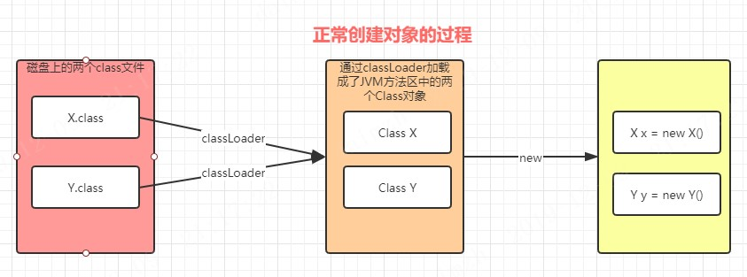
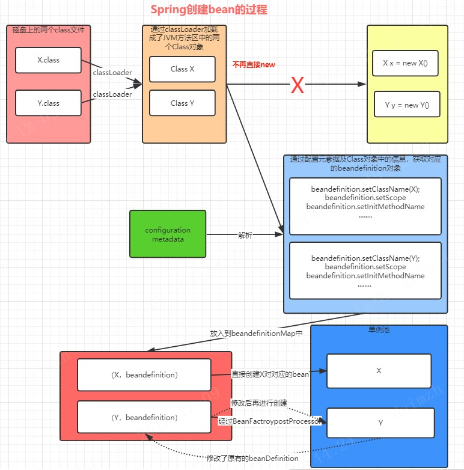
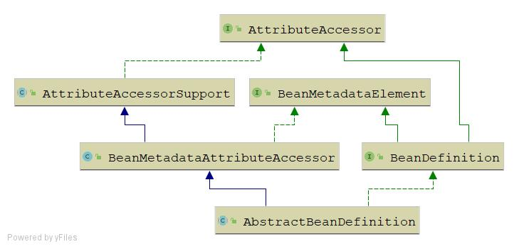
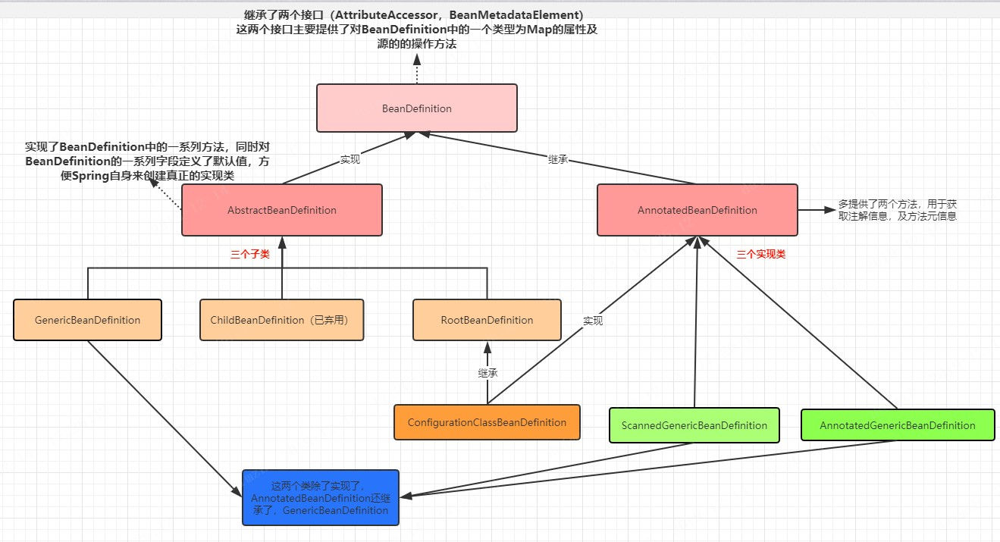

Spring官网阅读（四）BeanDefinition（上）

> 前面几篇文章已经学习了官网中的`1.2`,`1.3`,`1.4`三小结，主要是容器，Bean的实例化及Bean之间的依赖关系等。这篇文章，我们继续官网的学习，主要是`BeanDefinition`的相关知识，这是Spring中非常基础的一块内容，也是我们阅读源码的基石。本文主要涉及到官网中的`1.3`及`1.5`中的一些补充知识。同时为我们`1.7`小节中`BeanDefinition`的合并做一些铺垫

### `BeanDefinition`是什么？

我们先看官网上是怎么解释的：


从上文中，我们可以得出以下几点结论：

1. `BeanDefinition`包含了我们对bean做的配置，比如XML`<bean/>`标签的形式进行的配置
2. 换而言之，Spring将我们对bean的定义信息进行了抽象，抽象后的实体就是`BeanDefinition`,**并且Spring会以此作为标准来对Bean进行创建**
3. `BeanDefinition`包含以下元数据：
   - 一个全限定类名，通常来说，就是对应的bean的全限定类名。
   - bean的行为配置元素，这些元素展示了这个bean在容器中是如何工作的包括`scope`(域，我们文末有简单介绍)，`lifecycle callbacks`(生命周期回调，下篇文章介绍)等等
   - 这个bean的依赖信息
   - 一些其他配置信息，比如我们配置了一个连接池对象，那么我们还会配置它的池子大小，最大连接数等等

在这里，我们来比较下，正常的创建一个bean，跟Spring通过抽象出一个`BeanDefinition`来创建bean有什么区别：

**正常的创建一个java bean:**



**Spring通过`BeanDefinition`来创建bean:**



通过上面的比较，我们可以发现，相比于正常的对象的创建过程，Spring对其管理的bean没有直接采用new的方式，而是先通过解析配置数据以及根据对象本身的一些定义而获取其对应的`beandefinition`,并将这个`beandefinition`作为之后创建这个bean的依据。同时Spring在这个过程中提供了一些扩展点，例如我们在图中所提到了`BeanfactoryProcessor`。这些大家先作为了解，之后在源码阶段我们再分析。

### `BeanDefinition`的方法分析：

这里对于每个字段我只保留了一个方法，只要知道了字段的含义，方法的含义我们自然就知道了

```java
// 获取父BeanDefinition,主要用于合并，下节中会详细分析
String getParentName();

// 对于的bean的ClassName
void setBeanClassName(@Nullable String beanClassName);

// Bean的作用域，不考虑web容器，主要两种，单例/原型，见官网中1.5内容
void setScope(@Nullable String scope);

// 是否进行懒加载
void setLazyInit(boolean lazyInit);

// 是否需要等待指定的bean创建完之后再创建
void setDependsOn(@Nullable String... dependsOn);

// 是否作为自动注入的候选对象
void setAutowireCandidate(boolean autowireCandidate);

// 是否作为主选的bean
void setPrimary(boolean primary);

// 创建这个bean的类的名称
void setFactoryBeanName(@Nullable String factoryBeanName);

// 创建这个bean的方法的名称
void setFactoryMethodName(@Nullable String factoryMethodName);

// 构造函数的参数
ConstructorArgumentValues getConstructorArgumentValues();

// setter方法的参数
MutablePropertyValues getPropertyValues();

// 生命周期回调方法，在bean完成属性注入后调用
void setInitMethodName(@Nullable String initMethodName);

// 生命周期回调方法，在bean被销毁时调用
void setDestroyMethodName(@Nullable String destroyMethodName);

// Spring可以对bd设置不同的角色,了解即可，不重要
// 用户定义 int ROLE_APPLICATION = 0;
// 某些复杂的配置    int ROLE_SUPPORT = 1;
// 完全内部使用   int ROLE_INFRASTRUCTURE = 2;
void setRole(int role);

// bean的描述，没有什么实际含义
void setDescription(@Nullable String description);

// 根据scope判断是否是单例
boolean isSingleton();

// 根据scope判断是否是原型
boolean isPrototype();

// 跟合并beanDefinition相关，如果是abstract，说明会被作为一个父beanDefinition，不用提供class属性
boolean isAbstract();

// bean的源描述，没有什么实际含义 
String getResourceDescription();

// cglib代理前的BeanDefinition
BeanDefinition getOriginatingBeanDefinition();
```

### `BeanDefinition`的继承关系:

类图如下：


##### 1.`BeanDefinition`继承的接口：

- <span id="jump">`org.springframework.core.AttributeAccessor`</span>

先来看接口上标注的这段`java doc`

> ```
> Interface defining a generic contract for attaching and accessing metadata to/from arbitrary objects.
> ```

翻译下来就是：

这个接口为从其它任意类中获取或设置元数据提供了一个通用的规范。

其实这就是`访问者`模式的一种体现，采用这方方法，我们可以将**数据接口**跟**操作方法**进行分离。

我们再来看这个接口中定义的方法：

```java
void setAttribute(String name, @Nullable Object value);

Object getAttribute(String name);

Object removeAttribute(String name);

boolean hasAttribute(String name);

String[] attributeNames();
```

就是提供了一个获取属性跟设置属性的方法

那么现在问题来了，在我们整个`BeanDefiniton`体系中，这个被操作的**数据结构**在哪呢？不要急，在后文中的`AbstractBeanDefinition`会介绍。

- `org.springframework.beans.BeanMetadataElement`

我们还是先看`java doc`:

> Interface to be implemented by bean `metadata` elements that carry a configuration source object.

翻译：这个接口提供了一个方法去获取配置源对象，其实就是我们的原文件。

这个接口只提供了一个方法：

```java
@Nullable
Object getSource();
```

我们可以理解为，当我们通过注解的方式定义了一个`IndexService`时，那么此时的`IndexService`对应的`BeanDefinition`通过`getSource`方法返回的就是`IndexService.class`这个文件对应的一个`File`对象。

如果我们通过`@Bean`方式定义了一个`IndexService`的话，那么此时的source是被`@Bean`注解所标注的一个`Mehthod`对象。

##### 2.`AbstractBeanDefinition`：

###### `AbstractBeanDefinition`的继承关系：

先看一下类图：



- `org.springframework.core.AttributeAccessorSupport`

可以看到这个类实现了`AttributeAccerror`接口，我们在上文中已经提到过，`AttributeAccerror`采用了[**访问者**](#jump)的涉及模式，将**数据结构**跟**操作方法**进行了分离，数据结构在哪呢？就在`AttributeAccessorSupport`这个类中，我们看下它的代码：

```java
public abstract class AttributeAccessorSupport implements AttributeAccessor, Serializable {
	/** Map with String keys and Object values. */
	private final Map<String, Object> attributes = new LinkedHashMap<>();

    @Override
	public void setAttribute(String name, @Nullable Object value) {
		Assert.notNull(name, "Name must not be null");
		if (value != null) {
			this.attributes.put(name, value);
		}
		else {
			removeAttribute(name);
		}
	}
	......省略下面的代码
```

可以看到，在这个类中，维护了一个map，这就是`BeanDefinition`体系中，通过`访问者模式`所有操作的数据对象。

- `org.springframework.beans.BeanMetadataAttributeAccessor`

这个类主要就是对我们上面的map中的数据操作做了更深一层的封装，我们就看其中的两个方法：

```java
public void addMetadataAttribute(BeanMetadataAttribute attribute) {
    super.setAttribute(attribute.getName(), attribute);
}
public BeanMetadataAttribute getMetadataAttribute(String name) {
    return (BeanMetadataAttribute) super.getAttribute(name);
}
```

可以发现，它只是将属性统一封装成了一个`BeanMetadataAttribute`,然后就调用了父类的方法，将其放入到map中。

我们的`AbstractBeanDefinition`通过继承了`BeanMetadataAttributeAccessor`这个类，可以对`BeanDefinition`中的属性进行操作。这里说的属性仅仅指的是`BeanDefinition`中的一个map，而不是它的其它字段。

###### 为什么需要`AbstractBeanDefinition`？

对比`BeanDefinition`的源码我们可以发现，`AbstractBeanDefinition`对`BeanDefinition`的大部分方法做了实现（没有实现`parentName`相关方法）。同时定义了一系列的常量及默认字段。这是因为`BeanDefinition`接口过于顶层，如果我们依赖`BeanDefinition`这个接口直接去创建其实现类的话过于麻烦，所以通过`AbstractBeanDefinition`做了一个下沉，并给很多属性赋了默认值，例如：

```java
// 默认情况不是懒加载的
private boolean lazyInit = false;
// 默认情况不采用自动注入
private int autowireMode = AUTOWIRE_NO;
// 默认情况作为自动注入的候选bean
private boolean autowireCandidate = true;
// 默认情况不作为优先使用的bean
private boolean primary = false;
........
```

这样可以方便我们创建其子类，如我们接下来要讲的：`ChildBeanDefinition`,`RootBeanDefinition`等等

##### 3.`AbstractBeanDefinition`的三个子类

###### `GenericBeanDefinition`:

- 替代了原来的`ChildBeanDefinition`，比起`ChildBeanDefinition`更为灵活，`ChildBeanDefinition`在实例化的时候必须要指定一个`parentName`,而`GenericBeanDefinition`不需要。我们通过注解配置的bean以及我们的配置类（除`@Bena`外）的`BeanDefiniton`类型都是`GenericBeanDefinition`。

###### `ChildBeanDefinition`：

- 现在已经被`GenericBeanDefinition`所替代了。我在`5.1.x`版本没有找到使用这个类的代码。

###### `RootBeanDefinition`

- Spring在启动时会实例化几个初始化的`BeanDefinition`,这几个`BeanDefinition`的类型都为`RootBeanDefinition`
- Spring在合并`BeanDefinition`返回的都是`RootBeanDefinition`
- 我们通过`@Bean`注解配置的bean，解析出来的`BeanDefinition`都是`RootBeanDefinition`（实际上是其子类`ConfigurationClassBeanDefinition`）

##### 4.`AnnotatedBeanDefinition`

这个接口继承了我们的`BeanDefinition`接口，我们查看其源码可以发现：

```java
AnnotationMetadata getMetadata();

@Nullable
MethodMetadata getFactoryMethodMetadata();
```

这个接口相比于`BeanDefinition`， 仅仅多提供了两个方法

- `getMetadata()`,主要用于获取注解元素据。从接口的命名上我们也能看出，这类主要用于保存通过注解方式定义的bean所对应的`BeanDefinition`。所以它多提供了一个关于获取注解信息的方法
  - `getFactoryMethodMetadata()`,这个方法跟我们的`@Bean`注解相关。当我们在一个配置类中使用了`@Bean`注解时，被`@Bean`注解标记的方法，就被解析成了`FactoryMethodMetadata`。

##### 5.`AnnotatedBeanDefinition`的三个实现类

###### `AnnotatedGenericBeanDefinition`:

- 通过形如下面的API注册的bean都是`AnnotatedGenericBeanDefinition`

```java
public static void main(String[] args) {
    AnnotationConfigApplicationContext ac = new AnnotationConfigApplicationContext();
    ac.register(Config.class);
}
```

这里的`config`对象，最后在Spring容器中就是一个`AnnotatedGenericBeanDefinition`。

- 通过`@Import`注解导入的类，最后都是解析为`AnnotatedGenericBeanDefinition`。

###### `ScannedGenericBeanDefinition`:

- 都过注解扫描的类，如`@Service`,`@Compent`等方式配置的Bean都是`ScannedGenericBeanDefinition`

###### `ConfigurationClassBeanDefinition`:

- 通过`@Bean`的方式配置的Bean为`ConfigurationClassBeanDefinition`

最后，我们还剩一个`ClassDerivedBeanDefinition`,这个类是跟`kotlin`相关的类，一般用不到，笔者也不熟，这里就不管了！

### 总结：

至此，我们算完成了`BeanDefinition`部分的学习，在下一节中，我将继续跟大家一起学习`BeanDefinition`合并的相关知识。这篇文章中，主要学习了

1. 什么是`BeanDefinition`，总结起来就是一句话，Spring创建bean时的建模对象。
2. `BeanDefinition`的具体使用的子类，以及Spring在哪些地方使用到了它们。这部分内容在后面的学习中很重要，画图总结如下：




#### 1.5小结内容的补充

##### 单例：

一个单例的bean意味着，这个bean只会容器创建一次。在创建后，容器中的每个地方使用的都是同一个bean对象。这里用Spring官网上的一个原图：

在上面图片的例子中，`accountDao`在被其它三个bean引用，这三个引用指向的都是同一个bean。

在默认情况下，Spring中bean的默认域就是单例的。分XML跟注解两种配置方式：

```xml
<!--即使配置singleton也是单例的，这是Spring的默认配置-->
<bean id="accountService" class="com.something.DefaultAccountService" scope="singleton"/>
```

```java
@Component
// 这里配置singleton，默认就是singleton
@Scope(ConfigurableBeanFactory.SCOPE_SINGLETON)
public class LuBanService{

}
```

##### 原型：

一个原型的bean意味着，每次我们使用时都会重新创建这个bean。


在上面图片的例子中，`accountDao`在被其它三个bean引用，这三个引用指向的都是一个新建的bean。

两种配置方式：

```xml
<bean id="accountService" class="com.something.DefaultAccountService" scope="prototype"/>
```

```java
@Component
// 这里配置prototype
@Scope(ConfigurableBeanFactory.SCOPE_PROTOTYPE)
public class LuBanService{
    
}
```


